# GUIA LDAP
 
## Intalación [OpenLDAP - MySQL - phpLDAPadmin ]

1. Empezamos instalando el paquete [ slpad ] <pre>**sudo apt install slapd** --> [ donde contiene el servidor de **LDAP** ]  

2. Seguidamente instalaremos el servicio MySQL con <pre> **sudo apt install mysql-server**   

3. Al instalarse el servicio [ MySQL ] instalaremos el paquete phpldadmin <pre> **sudo apt install phpldadmin** 

4. Una vez instalado todo, empzemos a utilizar el servidor añadiendo esto a nuestra barra de direcciones 
~~~
http://HERE-MY-IP/phpldapadmin/
~~~
[ Y nos aparecera lo siguiente ] 

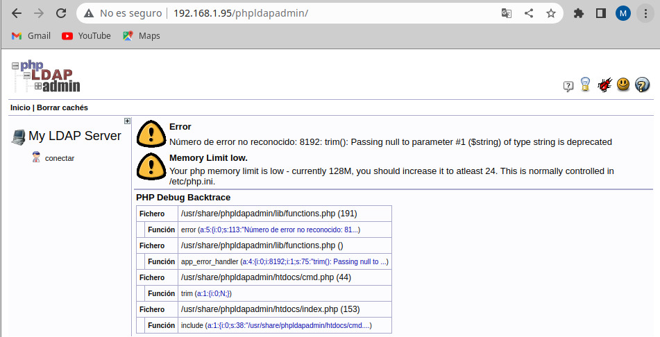

 [ Como vemos nos aparecen errores con el trim, si no sabes arreglar los problemas hay trucooo!!!! ]

5. En este mundo de la informatica los errores son muy frecuentes, por lo que este error ha sido arreglado por un chico en un .zip. Te dejo el comando para descargarlo <pre> **wget https://github.com/leenooks/phpLDAPadmin/archive/refs/tags/1.2.6.4.zip**

6. Al descargarse el archivo comprimido [ 1.2.6.4.zip ] lo llevamos a la ruta <code>/usr/share/phpldamin/</code> hacemos una copia de seguridad de todos los archivos/directorios de ella en y lo llevamos a otro directorio. Y seguidamente, despues de hacer la copia de seguridad, descomprimimos el archivo comprimido y llevamos todos los archivos/directorios del archivo comprimido a la ruta <code>//usr/share/phpldamin/</code>  

7. Y ahora vemos que si abrimos el LDAP no nos aparece ningun error

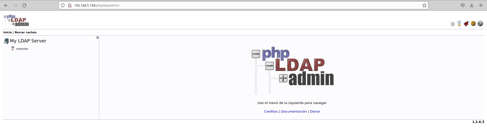

## Reconfigurando slapd

1. Lo primero para recongifurar slapd, es ejecutar este comando --> <code>sudo dpkg-reconfigure slapd</code>

2. Y después seguimos todo lo que nos muestran las imagenes

### 1
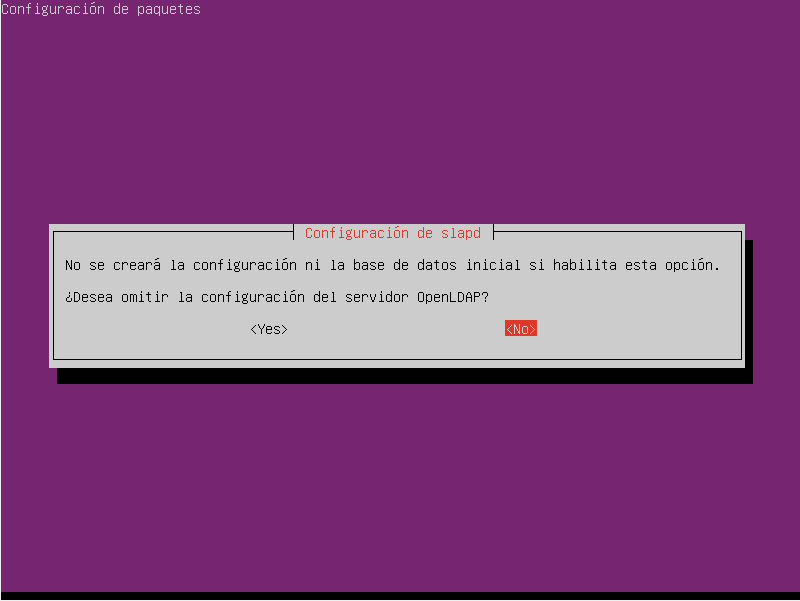

### 2.0 CREACION DEL DN
* Aqui ponemos el dominio que usaremos para crear el DN [ ubuntusrvXX.smx2023.net ] que equivale a <code>dc=ubuntusrvXX,dc=smx2023,dc=net</code>
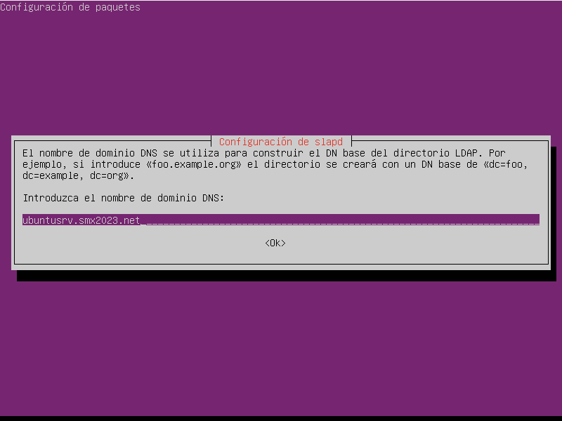

### 3 NOMBRE DE LA ORGANIZACIÓN
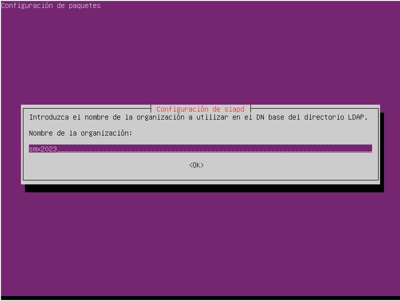

### 4 GESTION DEL SOFTWARE
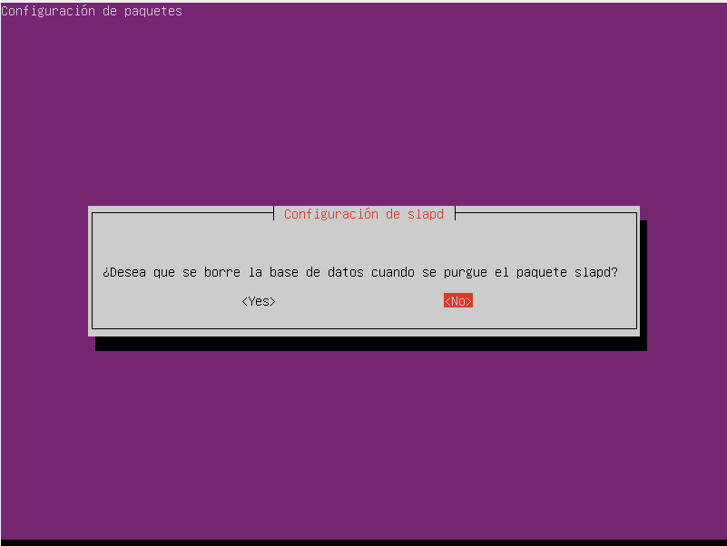

### 5 BASE DE DATOS ANTIGUA
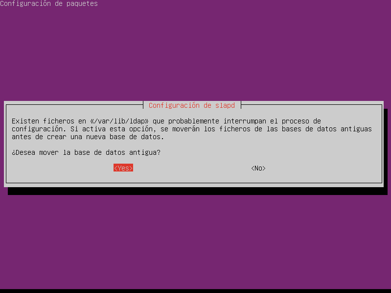

## Configurando phpLDAPadmin

* Ahora empezamos a configurar el phpLDAPadmin 

1. Para entrar en el servidor debemos poner <code> cn=admin,dc=ubuntusrvXX,dc=smx2023,dc=net </code> y la contraseña que habeis puesto [ en este caso <code>smx2023</code> ]

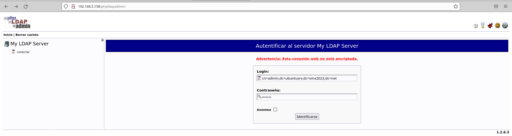

2. Y entramos para poder crear nuestros objetos
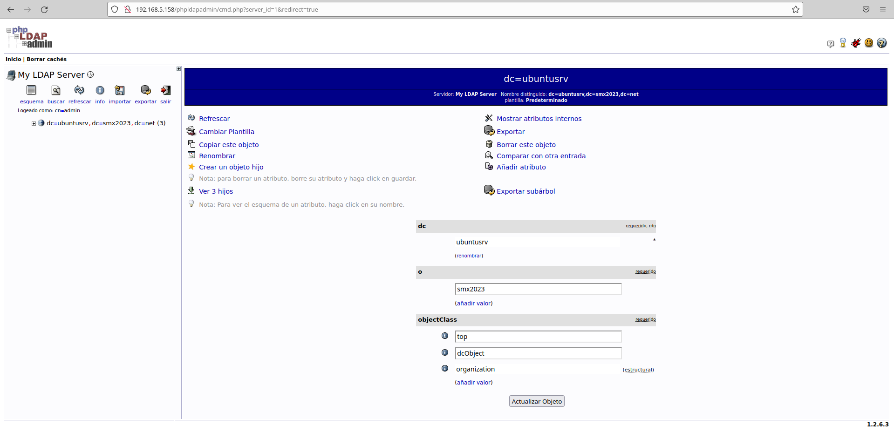

## CREANDO OBJETOS EN LDAP

* Como vemos en la imagen anterior, por la parte de la izquierda hay una opcion que pone **" Crear un objeto hijo"**

* Tenemos que seguir esta estructura:
~~~
dc=ubuntusrvXX,dc=smx2023,dc=net
    cn=admin
    cn=goblins
       cn=goblin01
ou=tropas
~~~

* Y quedaria finalmente así

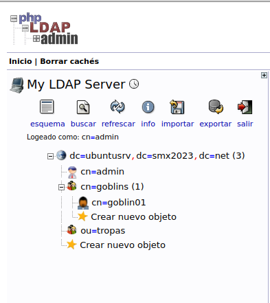

## INSTALACION DE LDAP-UTILS

* Ahora nos instalamos con <code>sudo apt install ldap-utils</code> para poder acceder a los datos contenidos en el LDAP desde la terminal

* Ahora para conectar con el <code>ldap server</code> ponemos en nuestra terminal <code>ldapsearch -x -h dc=ubuntusrv,dc=smx2023,dc=net -H ldap://YOUR-IP</code>

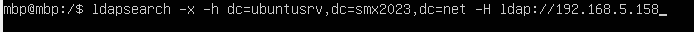

* Y nos aparece lo siguiente

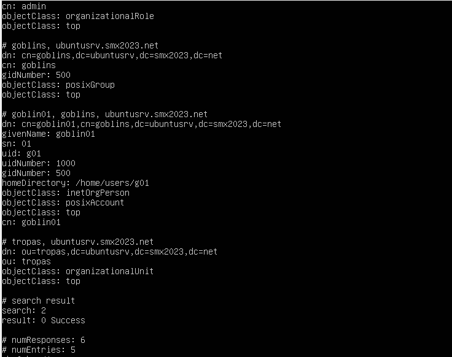

